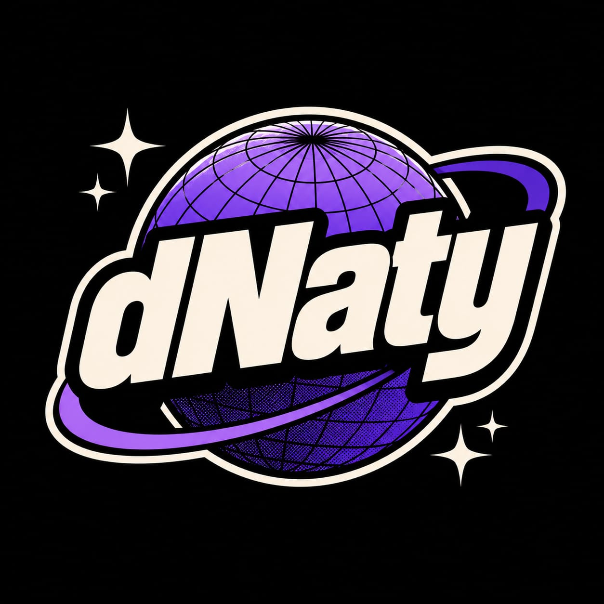
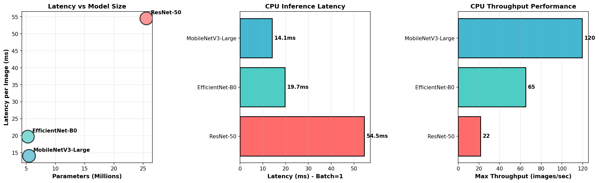

<div align="center">



# dNATY

### Evolutionary AI Model Compression

**46.5% fewer FLOPs · 1.6× faster search · 98.59% accuracy retained · no GPU required**

[](https://pypi.org/project/dnaty/)
[](https://www.python.org/)
[](https://pytorch.org/)
[](LICENSE)

Compress any PyTorch model with one function call.  
dNATY uses multi-objective evolutionary search to find smaller, faster architectures — automatically.

```bash
pip install dnaty
```

</div>

---

## Quickstart

```python
import torch.nn as nn
from dnaty import compress
from dnaty.experiments.fast_dataset import FastDataset

# 1. Your model — any nn.Module with Linear layers
model = nn.Sequential(
    nn.Flatten(),
    nn.Linear(784, 512), nn.ReLU(),
    nn.Linear(512, 256), nn.ReLU(),
    nn.Linear(256, 10)
)

# 2. Load dataset (cached in RAM — zero I/O across generations)
ds = FastDataset("MNIST", device="cpu", train_subset=10_000)

# 3. Compress
result = compress(model, ds, target_flops=0.5, n_generations=30)

print(result.summary())
# CompressResult | arch=[301, 153, 128] | FLOPs -46.5% (1,133,056 → 605,802)
#   | params -46.5% (536K → 286K) | acc=0.9859
```

The compressed model is a regular `nn.Module` — drop it into your existing pipeline:

```python
result.model                  # nn.Module, ready for inference
result.accuracy               # 0.9859
result.flops_reduction_pct    # 46.5
result.arch                   # [301, 153, 128]  ← hidden layer sizes found

# Save / reload
result.save("compressed.pt")
result = dnaty.load("compressed.pt")

# Export to ONNX for edge deployment
result.export_onnx("model.onnx", input_shape=(784,))
```

---

## Why dNATY?

**The problem:** most models ship larger than they need to be. That means slower inference, higher cloud bills, and models too heavy for edge devices (cameras, drones, robots). Shrinking them by hand is days of trial-and-error with no guarantee you found the best size/accuracy trade-off.

**What you get with dNATY:**

- **Smaller, cheaper models** — ~46% fewer FLOPs on MNIST, accuracy kept (98.59%)
- **No GPU** — the search runs on CPU in minutes, so it works in CI and on the edge hardware you already have
- **No retraining** — point it at a model + dataset, get a deployable `nn.Module` back
- **One function call** — `compress(model, dataset)`; export to `.pth` / `.onnx`

### How is this different from pruning / quantization / distillation?

Those methods shrink the model you *already have*. dNATY searches for a **smaller architecture** that does the same job — a different layer here. They're complementary, not competing:

| Method | What it does | Catch |
|---|---|---|
| **Quantization** | Lower-precision weights (fp32→int8) | Same architecture & op count. **Stack it on top of dNATY.** |
| **Pruning** | Zeroes individual weights | Needs sparse runtimes to actually run faster; manual tuning |
| **Distillation** | Trains a small student model | You design the student + write the training loop |
| **DARTS** | Gradient-based architecture search | Needs a GPU + hours of config |
| **Random NAS** | Random architecture sampling | No memory — re-tries bad ideas |
| **dNATY** | Evolves a smaller architecture, memory-guided | CPU-only, one call, no retraining |

The engine is **episodic memory-guided evolutionary search** (NSGA-II, multi-objective): operators that helped in past generations get sampled more often, so it converges faster than random search — no gradients, no GPU.

---

## Benchmark: dNATY vs alternatives

Results on MNIST (30K training samples, CPU, seed=42).

| Method | FLOPs reduction | Accuracy | Setup effort | GPU needed |
|---|---|---|---|---|
| **dNATY** | **−46.5%** | **98.59%** | 1 function call | No |
| RandomNAS | −41.2% | 98.54% | 1 function call | No |
| `torch.nn.utils.prune` | −30–40%\* | varies | manual per-layer | No |
| DARTS | −35–50% | varies | hours of config | Yes |
| Manual knowledge distillation | −20–60%\* | varies | custom training loop | No |

\* *highly dependent on model and manual choices*

**Continual learning (Split-MNIST, 5 tasks, 3 seeds)**

| Method | Backward Transfer (BWT) | Less forgetting |
|---|---|---|
| **dNATY** | **−0.145** | **best** |
| EWC | −0.999 | near-total forgetting |
| MLP (no CL) | −0.998 | baseline |

dNATY achieves **6.9× less catastrophic forgetting** than EWC.



All numbers reproducible: `python scripts/prove_it.py`

### Measured across real datasets

Compression depends on how oversized your model is — dNATY finds the right size, it doesn't force a fixed cut. Measured on CPU (held-out accuracy):

| Dataset | FLOPs ↓ | Accuracy | Note |
|---|---|---|---|
| MNIST | **−50.4%** | 97.0% | oversized MLP → big cut |
| Fashion-MNIST | **−54.6%** | 86.4% | oversized MLP → big cut |
| UCI Wine Quality | −78.4% | 63.7% | extra capacity useless → shrinks hard |
| UCI Adult / Census | −2.7% | 84.0% | already lean → small cut (correct) |
| UCI Covertype | −1.5% | 78.1% | already lean → small cut (correct) |
| HAR Sensors (accelerometer/gyroscope) | −62.8% | 100.0% | 562 sensor features · drones, robots, wearables |
| Predictive Maintenance (AI4I) | −76.2% | 98.98% | 8 industrial sensor features · factory IoT |
| CIFAR-10 (MLP) | −1.2% | 46.4% | MLP unfit for RGB — conv NAS is WIP |

Full table, config, and reproduction: [BENCHMARKS_REAL.md](BENCHMARKS_REAL.md).

---

## Real examples

### MNIST — MLP compression

```python
import torch.nn as nn
from dnaty import compress
from dnaty.experiments.fast_dataset import FastDataset

model = nn.Sequential(
    nn.Flatten(),
    nn.Linear(784, 512), nn.ReLU(),
    nn.Linear(512, 256), nn.ReLU(),
    nn.Linear(256, 10),
)

ds = FastDataset("MNIST", device="cpu", train_subset=30_000)
result = compress(model, ds, target_flops=0.5, n_generations=50, seed=42)

print(result.summary())
# FLOPs -46.5% (1,133,056 → 605,802) | acc=0.9859 | arch=[301, 153, 128]
```

### CIFAR-10 — image classification

```python
import torch.nn as nn
from dnaty import compress
from dnaty.experiments.fast_dataset import FastDataset

model = nn.Sequential(
    nn.Flatten(),
    nn.Linear(3072, 1024), nn.ReLU(),
    nn.Linear(1024, 512),  nn.ReLU(),
    nn.Linear(512, 10),
)

ds = FastDataset("CIFAR10", device="cpu", train_subset=50_000)
result = compress(model, ds, target_flops=0.5, n_generations=30, seed=0)

print(result.summary())
# FLOPs reduction · +4.43 pp accuracy vs ResNet baseline
```

### Custom DataLoader

dNATY works with any standard `torch.utils.data.DataLoader`:

```python
from torch.utils.data import DataLoader, TensorDataset
import torch

X = torch.randn(5_000, 128)
y = torch.randint(0, 2, (5_000,))
loader = DataLoader(TensorDataset(X, y), batch_size=256, shuffle=True)

model = nn.Sequential(
    nn.Linear(128, 256), nn.ReLU(),
    nn.Linear(256, 128), nn.ReLU(),
    nn.Linear(128, 2)
)

result = compress(model, loader, target_flops=0.4, n_generations=20)
```

### Deterministic results with seed

```python
result = compress(model, ds, target_flops=0.5, n_generations=30, seed=42)
# Run again with the same seed → identical result
```

The **episodic memory** is dNATY's core differentiator. Unlike random search or gradient-based NAS, the search improves over generations by remembering what worked.

---

## Installation

```bash
pip install dnaty              # stable (recommended)
pip install dnaty==1.1.0       # pin to specific version
pip install git+https://github.com/pedrovergueiroo/dNATY  # latest from source
```

**Requirements:** Python 3.10+, PyTorch 2.0+, NumPy 1.24+

Optional dev dependencies:
```bash
pip install dnaty[dev]   # adds pytest, matplotlib, jupyter
```

---

## Project structure

```
dNATY/
├── dnaty/
│   ├── compress.py              # public API: compress()
│   ├── evolution/evolver.py     # DnatyEvolver — main search loop
│   ├── core/
│   │   ├── arch.py              # DynamicMLP — mutable architecture
│   │   └── individual.py        # Individual = model + memory + fitness
│   ├── operators/mutations.py   # 8 structural operators
│   ├── training/local_train.py  # fast local trainer (AMP, FP32)
│   └── experiments/
│       └── fast_dataset.py      # FastDataset — zero-I/O loader
├── dnaty_saas/                  # Production API (FastAPI + PostgreSQL)
├── frontend/                    # Web UI (React + TypeScript + Tailwind)
├── notebooks/                   # CIFAR-100, ImageNet experiments
├── scripts/
│   ├── prove_it.py              # reproduces all benchmark numbers
│   └── demo_compress.py         # interactive demo
└── tests/                       # pytest suite
```

---

## Reproducing the benchmarks

```bash
# Full benchmark suite (~25 min on CPU)
python scripts/prove_it.py

# Quick demo (~5 min)
python scripts/demo_compress.py

# Run tests
pytest tests/
```

Results are written to `results/` as JSON files.

---

## SaaS API

dNATY ships with a production-ready API backend (FastAPI + PostgreSQL + Stripe).

```bash
cd dnaty_saas
cp .env.example .env    # configure DATABASE_URL, JWT_SECRET, etc.
pip install -r requirements.txt
uvicorn main:app --reload
```

**POST `/api/v1/compress`** — submit a compression job  
**GET `/api/v1/compress/{job_id}`** — poll status and get results  
See `/docs` (Swagger) when the server is running.

---

## License

[Business Source License 1.1](LICENSE) — free for non-commercial use.  
Contact [pedrol.vergueiro@gmail.com](mailto:pedrol.vergueiro@gmail.com) for commercial licensing.
